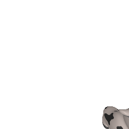

# SDF Tracker

Goal: Use a model of an object to track it in a 3d scene

## Stages

1.) Build a model
Multiple views (How many are needed? 10?)
For each image:
    - Segmentation of that object
    - Camera pose relative to object (Or vice-versa)

2.) Pose estimation
Given an image:
    - Find the object in the image (Detection or semantic segmentation)
    - estimate the pose (Center of detection at some estimated distance?)
    - Refine estimate using sdf as a distance function (or ICP)

3.) 'Tracking'
For sequence of images:
Perform pose estimation, but use previous estimate as the initial guess

## Approaches

1.) Model Building

a.) Simulation
Find some 3d models
Load them into 

b.) Kinect as depth camera
Use Segment Anything model with clip or some other similarity for sequences
use salient feature segmentation
use motion grouping for moving objects?

For poses, use COLMAP for static objects
    Then post process the results to be useful in pytorch3d

2.) Tracking
Given Trained SDF Models
    Assume the corresponding object to track is in frame

Given an image
    Segment / detect things in image
    <?> Compare each detection to a rendered image of the SDF
        Generate visual (CLIP) encodings, the cosine similarity?
    
    1.) SDF-loss
        use depth image/measurements and feed 3d points as input to SDF
            outputs are the distance, and average is the loss
            update SDF Origin / Transform using backprop
            repeat

a.) Simulation
    Generate RGB-D Renderings of the model offset in space, and rotated
        ? Assume Camera is at 0,0,0?
        run tracker
        Compare predicted pose to ground truth pose 

b.) Kinect
    Assume the same process as with simulation, but
    use RGB-D images from physical camera instead (No GT poses)

3.) Same as 2.) but test with sequences with object motion

Versioned file descriptions:
pose_estimate_obj_v1 - performs pose estimation (Using an obj or sphere) but only localizes it to a single location
v2 - operates on a translating object, but does not handle rotation
